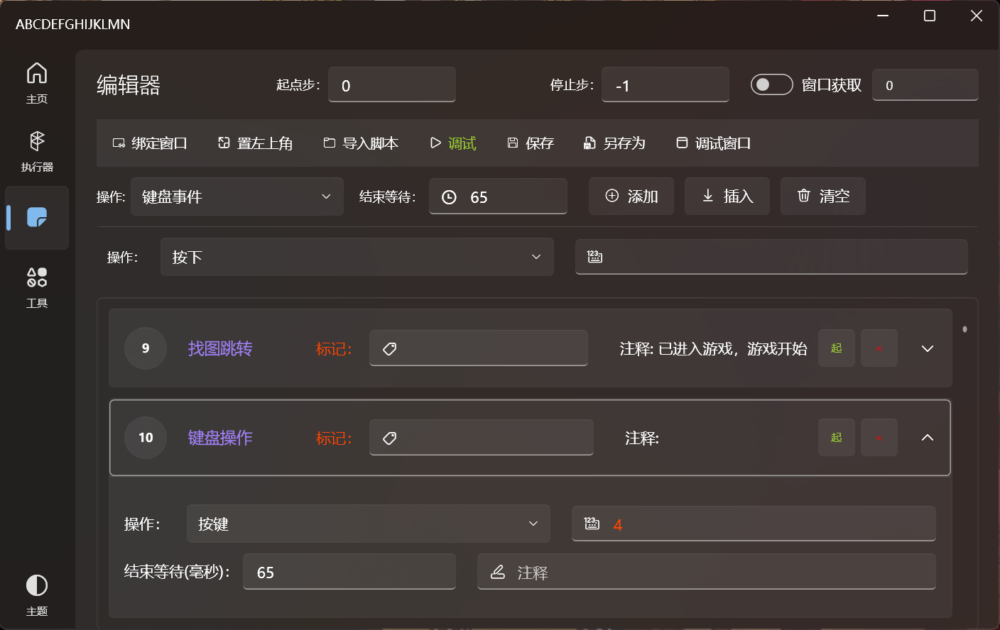

# GameScriptsPlayer
脚本执行器

 

免责声明：  
本程序不针对任何游戏、软件！  
使用本程序导致游戏封号、账号被屏蔽等后果自行负责，与本作者无关！  
使用本软件或本源代码二次开发请遵守法律，请勿用于非法用途。  

程序说明：  
此程序使用了大漠插件为底层开发，本软件控制层开源免费、但大漠插件是收费的，目前收费貌似50块700天，约7分钱1天/1台电脑  
VS2022+.Net6+WPF+大漠插件7   

使用说明（2022-9-12）：  
(程序仍在开发中......)  
(目前只支持单线程执行，多线程开发中....)  

不会编程朋友看这里：软件下载（9月8日更新）：
http://pan.gzmtr.cc/file/2730b15o27zyvj055tw3kli5cdd9cjl2# 
密码:123

一、添加大漠插件注册码

    1.注册码获得方式一：可以去某宝购买，50块700天
    2.注册码获得方式二：贴吧有人分享，但不稳定，经常失效    
        (程序内置了吧友分享的注册码，但可能随时失效)
    3.注册码添加方式一：程序设置中添加 附加码+激活码 点击应用检测注册码可用性
    4.注册码添加方式二：内置法，在源码DM/DmConfig.cs类中添加 注册码：DmRegCode=xxxxx  附加码 DmVerInfo=xxxxx

一、需要右键“以管理员身份运行”  
二、绑定窗口，启用窗口获取开关，将鼠标移到所要绑定的软件、游戏窗口上面，按快捷键ALT+A获取窗口句柄，    最后点击窗口绑定，直到弹出“绑定成功”为止。 如程序、游戏崩溃，则重启游戏重新操作绑定。  
    1.Windows10: dx2 dx2 dx 11  
    2.Windows11: dx2 dx2 dx 0/11  
三、绑定成功后可以执行导入或者自己添加的步骤。  

脚本使用说明：

    1.标记功能：每一步都含有标记功能，默认为空，当填入文字后，如"打怪"，则表示将在此步设置为“打怪”标记点，后期可通过跳转功能跳转到此步，类似于按键精灵的 GOTO功能，  标记名称是唯一的，       不可重复。
    
    2.跳转功能：跳转语句、找图跳转、找色跳转等功能，在“跳转目标标记”中输入目标行的标记名称，如“打怪”，填入循环次数(循环次数=0表示无限次数，大于0次则跳转指定次数，不可为负数)。
    
    3.结束等待：表示此步执行完毕后等待多长时间再执行下一步。
    
    4.注释：用来注释此步的作用，和调试窗口输出，对程序执行不影响。
    
    5.键盘操作：选择键盘操作：按下、弹起、按键等，输入要操作的按键，如：A，ENTER（回车），Space（空格键）。(按键名不分大小写)    
    
    6.鼠标操作：选择鼠标操作：左键单击、按下、移动鼠标等，移动鼠标(相对坐标)：X>0时鼠标右移，X<0时，鼠标左移，Y>0时下移，Y<0时上移动，模拟滑动=关闭（鼠标瞬移），开启（模拟线性滑动）     如：移动鼠标至左上角，X=-150，Y=-150，耗时=200（单位：毫秒），模拟滑动=开启
    
    7.延迟事件：脚本等待指定时间(单位：毫秒)后再执行下一步
    
    8.限时找图：图片须要bmp格式，24位，且要保存到根目录的“Resources”文件夹中（后期将会更改为自定义图片目录），如：确定.bmp  
               图片名：确定.bmp ，同时找多图用 “|” 号隔开，如：确定.bmp|关闭.bmp    
               相似度：范围0.1~1 ，越接近1找图越精确，但相对速度越慢，一般设置为0.7~0.8  
               左上/右下角坐标：所要找图范围的左上角坐标x，y轴，假设窗口大小为1080p，要全窗口内找图：则填：x1=1，y1=1 ,x2=1920,y2=1080     
               找到跳转标记/未找到跳转标记：参考第2点，留空表示执行下一步  
               
    9.找图点击：参数如8点，找到图后将会自动点击，然后执行下一步，相关参数参考8点  
    
    10.限时找色：颜色值：如同时找多个颜色  00d22d|00cb2c|01c62e|01ba2c ，其他参数参考第8点，找到跳转标记/未找到跳转标记：参考第2点，留空表示执行下一步  
    
    11.文本输入：将所要输入的文本以粘贴的形式输出到对象窗口，如：在逆战游戏中发送"你好，666"，需要以下三个步骤：
                1）按键 ENTER
                2) 文本输入：你好，666
                3）按键 ENTER
                
    12.随机延迟等待：输入随机范围的最小时间 如100 和最大时间1000（单位：毫秒），程序运行到此步时将会在 0.1秒~1秒之间随机一个数，然后等待这个时间后执行下一步  
    
    13.按键复归：用于复归按键=按下状态 时未执行弹起命令造成的按键卡死状态，一般用于手动停止和判断角色中途挂了，就先复归按键，然后用跳转功能跳回开始，重新开始游戏  
    
    14.结束进程：填入程序名称即可直接结束所有此进程的程序，一般用于关机之前使用，因为有些游戏或软件会阻止关机，同时关闭多个程序用“|”隔开  
                如：同时关闭 Wegame 和 逆战  则填入：wegame|TGame                
    
    15.关机：不用解释，就是关闭电脑，一般用于指定 脚本循环多少次后使用跳转功能跳到关机  
    
    16.随机跳转，输入2个或者两个以上的标记名，脚本运行时将会随机跳转到其中一个标记步，格式如：打怪|回城|喝蓝  
    
    17.多线程同时执行：开发中......
    
    
    

